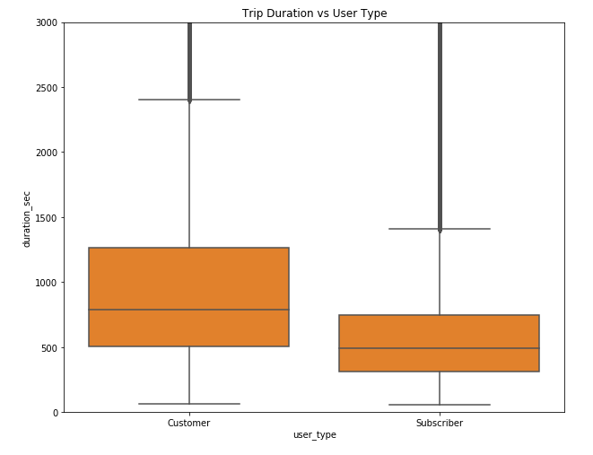
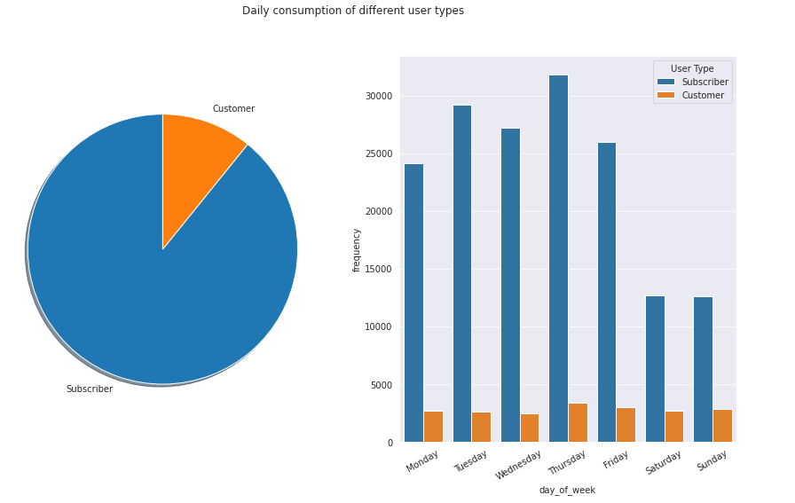

# (Ford Gobike Data Exploration)
## by (Mustafa Awny)

## Dataset

• This data set includes information about individual rides made in a bike-sharing system covering the greater San Francisco Bay area.

• The data has 183,412 trip record of FordBike with features(duration_sec, start_time, end_time, start_station_id, start_station_name, start_station_latitude, start_station_longitude, end_station_id, end_station_name, end_station_latitude ,end_station_longitude, bike_id, user_type, bike_share_for_all_trip)

• I had to use some feature engineering and transformations to create new columns to be able to get more insights and fnd any correlation during the multivariate exploration phase.

## Summary of Findings

• The trip duration has a high frequency that is concentrated at 600 seconds peak.

• Casual customers, non-members, have longer trips!

• There is no direct correlation between the start and end stations and the trip duration.

• Saturday and Sunday have the highest trip duration which makes sense for weekends.

## Key Insights for Presentation

• The number of subscribers using the bike sharing system is much more than casual customers, about 9 times.

• Weekends have the highest trip durations for subscribers and casual customers.

• Start and end hours of working days tend to have the highest count of both the subscribers and casual customers.

• Subscribers tend to have less trip duration than the casual customers, which is interesting!

